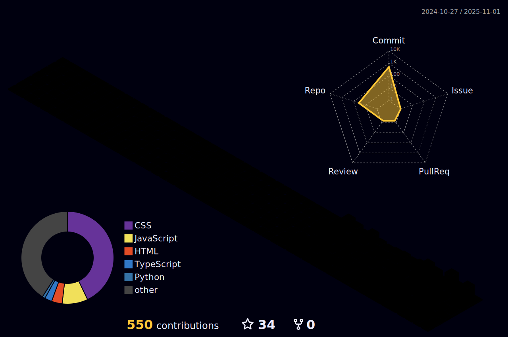

  

<h2 align="center">I'm Karun Binny </h2>

    

  

  

  

<h3 align="center">LANGUAGES AND TOOLS</h3>

  

  

<h3 align="center">GITHUB STATUS</h3>

  

  

  

<table>
  <tr>
    <td>
      
    </td>
    <td>
             
    </td>
    <td>
      
    </td>
  </tr>
</table>

  

  

  

  

  

  

  

